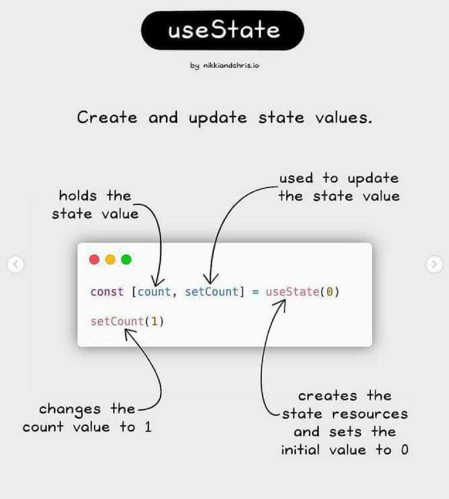

# useState



**useState hook** is a React hook that lets you manage state in functional components. 

useState returns an array with exactly two items:
-  current state: 
-  setState function

```javascript
const [age, setAge] = useState(42);
const [name, setName] = useState('Taylor');
```
Example:
```javascript
import React, { useState } from 'react';

const MyComponent = () => {
  const [count, setCount] = useState(0);

  const incrementCount = () => {
    setCount(count + 1);
  };

  return (
    <div>
      <p>Count: {count}</p>
      <button onClick={incrementCount}>Increment</button>
    </div>
  );
};

export default MyComponent;
```

#### Common Rules of use state hook

- Only call useState at the **`top level`** of your component. 
- Do not call useState inside **`loops, conditions, or nested functions`**
- Do not use useState to manage global state.
- Use useState to manage **`local state`**. 


### Common Mistakes in useState:

#### 1. Never modify the state directly

```javascript
// Don't do this
// count = count + 1;

// Do this instead
setCount(count + 1);
```


#### 2. State updates are asynchronous || Function version to update State

```javascript
// Correct approach for updating state based on previous value
setCount(prevCount => prevCount + 1);
```


```diff
! don't use this
setCount(count + 1)
setCount(count + 1)        // This may override eachother

! use this
setCount(prevcount => prevcount + 1)
setCount(prevcount => prevcount + 1)
```

#### 3. Use Optional Chaning ?. 
while accesing variables. 

```javascript
const [user, setUser] = useState({
    name: "",
    email: "",
    image: []
})

<h2>{user?.name}</h2>
<h2>{user?.email}</h2>
<h2>{user?.image[1]}</h2>
```

#### 4. Just update **specific** object value, without disturbing other.

```javascript
const [input, setInput] = useState("")
const [user, setUser] = useState({
    name: "abc",
    email: "abc@gmail.com",
    age:22
})

const changeUsername = () => {
    setUser((prev) => ({...prev, name: input}))
}

<input type="text" value={username} onChange={e => setInput(e.target.value)} />
<button onClick = {changeUsername}>Change Name </button>
```


### 5. Update Multiple Inputs states in one place


```javascript
import React, { useState } from 'react';

const MyComponent = () => {
  const [userData, setuserData] = useState({
    name: '',
    age: '',
    gender: ''
  });
```

#### Method `1`
```javascript
  const handleInputChange = (event) => {

    setuserData({...userData, [event.target.name: event.target.value}));
  };
```

#### Method `2`
```javascript
  const handleInputChange = (event) => {

    setuserData((prevData) => ({ ...prevData, [event.target.name: event.target.value}));
  };
```

#### Method `3`
```javascript
  const handleInputChange = (event) => {
    const { name, value } = event.target;

    setuserData((prevuserData) => ({
      ...prevuserData,
      [name]: value
    }));
  };
```

**`Name`** & **`Value`** should be same. 
```javascript
  return (
    <div>
      <input
        type="text"
        name="name"
        value={userData.name}
        onChange={handleInputChange}
      />
      <input
        type="text"
        name="age"
        value={userData.age}
        onChange={handleInputChange}
      />
      <input
        type="text"
        name="gender"
        value={userData.gender}
        onChange={handleInputChange}
      />
    </div>
  );
};

export default MyComponent;
```
