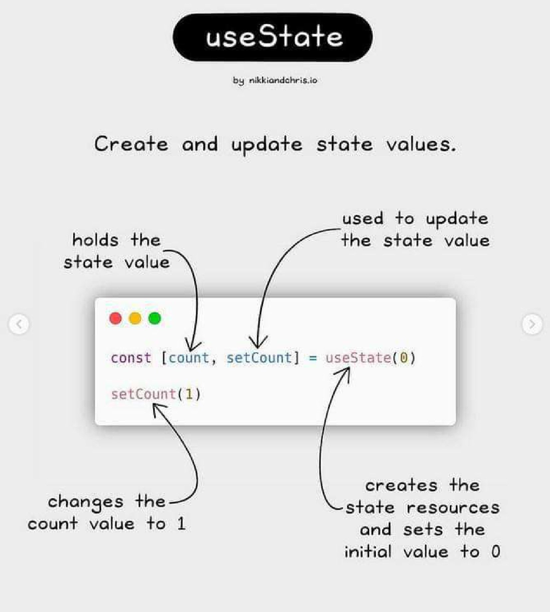
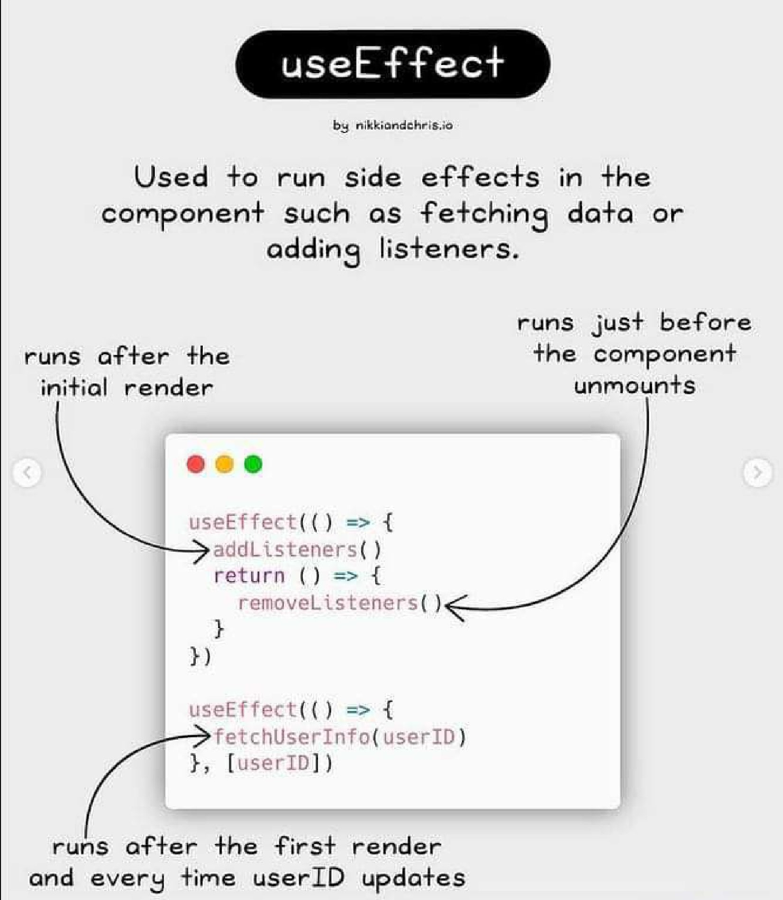
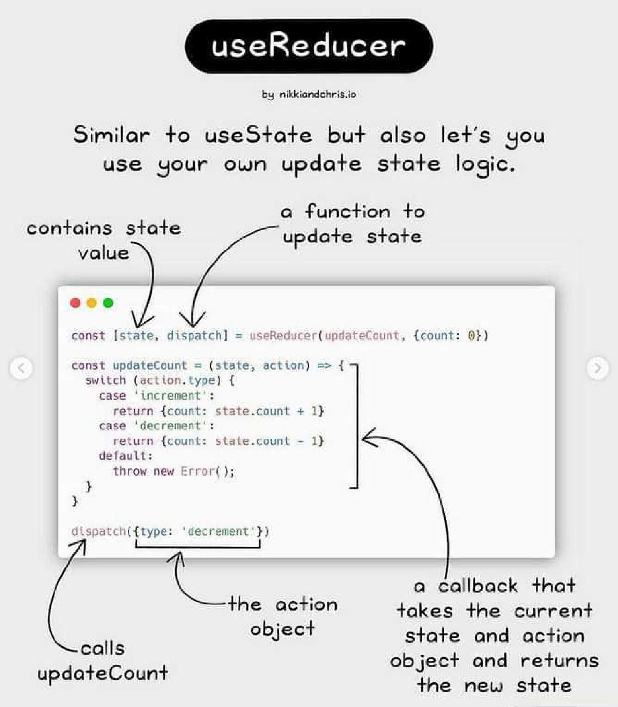
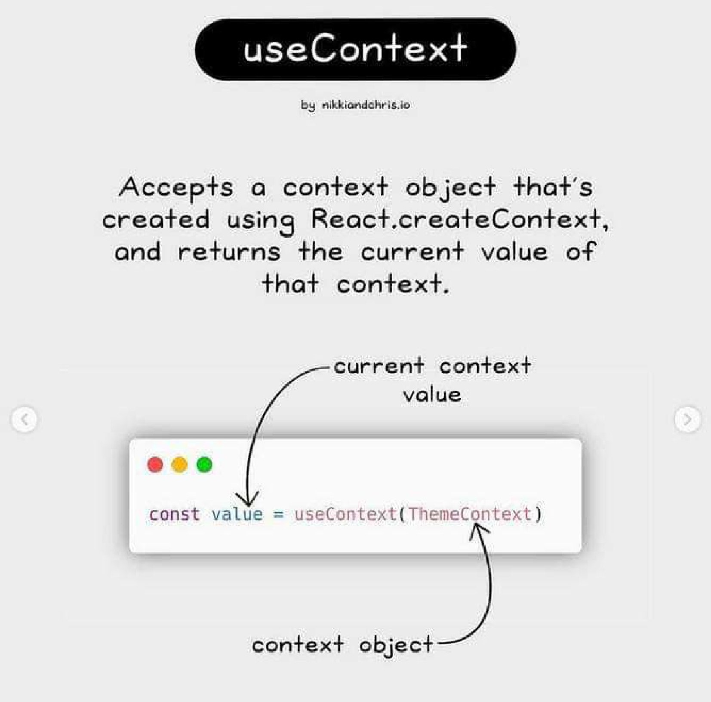
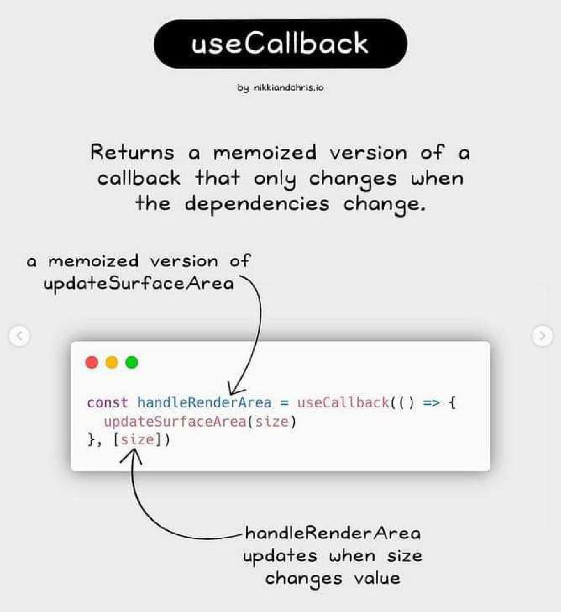
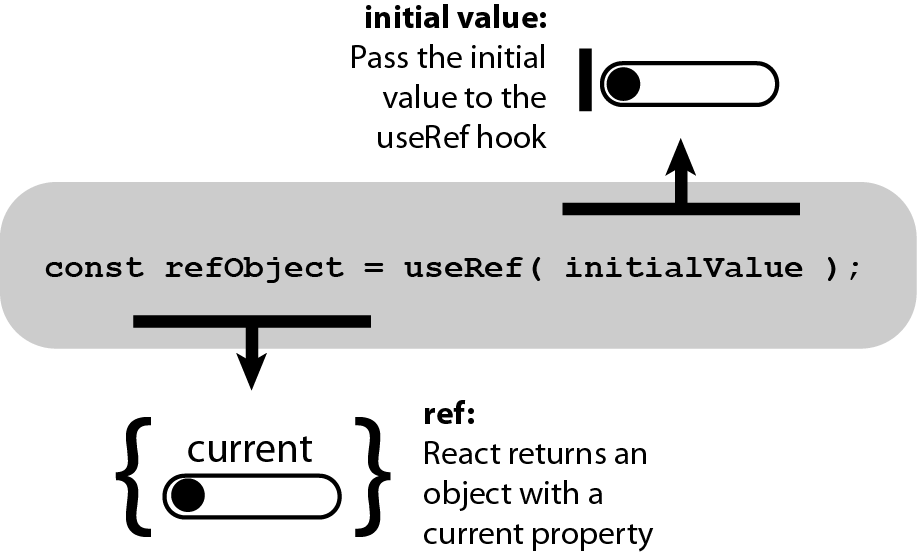

# React Hooks

Hooks List
- useState
- useEffect
- useLayoutEffect
- useReducer
- useContext 
- useMemo
- useCallback
- useRef - useForwardRef
- useId

## useState

## useEffect

## useLayoutEffect

## useReducer

## useContext 

## useMemo

## useCallback

## useRef 

## useForwardRef

## useId

