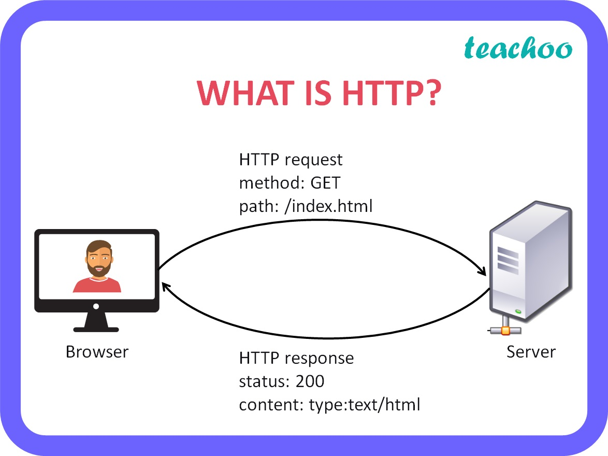
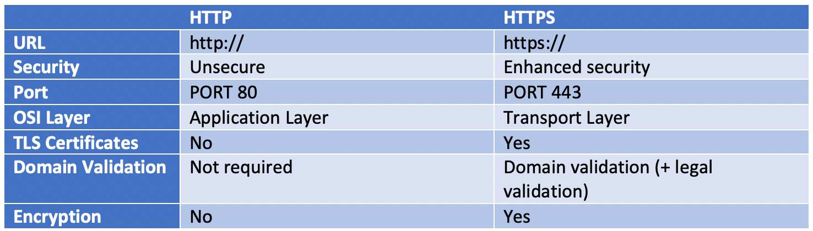

# Interview Questions

Table of content

- HTTP
  - Difference b/w HTTP - HTTPS
- CDN
- Declarative vs Imparitive Programming
- MonoRepo
- TurboRepo
- Microservices
- Serverless
- REST Apis
-
-
-

## HTTP

- HTTP Stands for Hyper Text Transfer Protocol. 

- HTTP is a protocol for fetching resources such as HTML documents. It is the foundation of any data exchange on the Web and it is a client-server protocol, which means requests are initiated by the recipient, usually the Web browser. 
- A complete document is reconstructed from the different sub-documents fetched, for instance, text, layout description, images, videos, scripts, and more.

- Clients and servers communicate by exchanging individual messages (as opposed to a stream of data). The messages sent by the client, usually a Web browser, are called requests and the messages sent by the server as an answer are called responses.

## HTTP - HTTPs

## CDN

## Declarative vs Imparitive Programming

imperative programming languages include:

- Java
- C
- Pascal
- Python
- Ruby
- Fortran
- PHP

Declarative programming languages include:

- SQL
- Miranda
- Prolog
- Lisp
- Many markup languages (e.g., HTML)

## MonoRepo

- 

## TurboRepo

- 

## Microservices

- 

